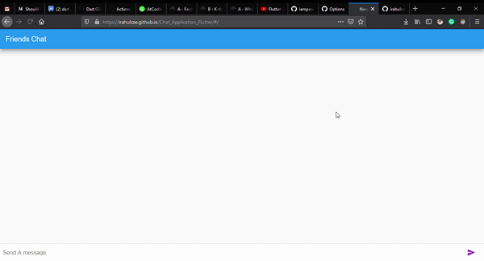
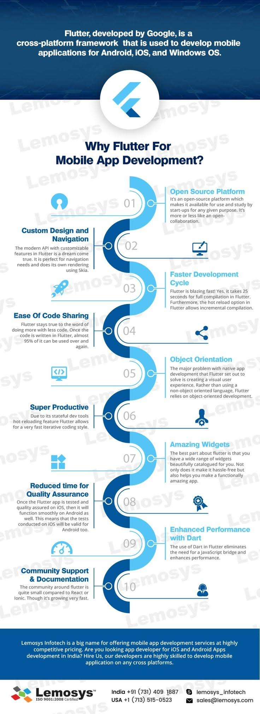

# A-Complete-Guide-To-Flutter :boom:
This repo contains all the source code posted on Medium and also contains all the projects which had been created till now.

All Tutorials plus additional snippets and shorter posts can be found on the [Medium Page](https://medium.com/boring-apps)

### Show some love :heart: and star the repo to support the project

If you had like the project pls hit the star :+1: icon.

### Working GIFS:

### Live Working Project

**001 - Building a Notes App in Flutter - UI example:** [Source]()- In this tutorial we break down the UI into Flutter Widgets, complete our layout and then tweak to get our final design to match our screenshots.

**002 - Chat Application in Flutter** (https://irahulcse.github.io/Chat_Application_Flutter/#/)- This is the basic project in which I had created the simple application by learning from **MTECH VIRAL'S VIDEO**.

### Created with :heart:

[Rahul Chandra](https://github.com/irahulcse) ([@1rahulchandra1](https://www.twitter.com/1rahulchandra)) ([Linkedin](https://www.linkedin.com/in/rahul-chandra-a8371b11b/))

### Follow Me On:

## Getting Started

For help getting started with Flutter, view our online
[documentation](https://flutter.dev/).

## Contribution:
Please clone and star this repo to stay up to date on changes. If anyone, would like to contribute to it. You can open the issue and start contributing to it.

## Education:
All my brothers and sister, it is very important to understand that we are here to learn and excel in our professional life. So it's not really important from where we learn the stuff either from Youtube, Medium etc. If any one of you had some great website to share. Pls open an issue. I am looking forward to create the one of the **Biggest Repository On Flutter**, so that any one can learn from it.

## Tutorials

**001 - Building a Notes App in Flutter - UI example:** [Source]()- In this tutorial we break down the UI into Flutter Widgets, complete our layout and then tweak to get our final design to match our screenshots.

**002 - Chat Application in Flutter** [Source]()- This is the basic project in which I had created the simple application by learning from **MTECH VIRAL'S VIDEO**.

### Some Git Commands for Best Workflow Practices: 
You can follow the below workflow, if you are new to Git. 

#### Initial setup
1. Fork the main A-Complete-Guide-To-Flutter
2. Clone this repo on your machine
3. Add the main repo as "upstream"
  * `git remote add upstream https://github.com/irahulcse/A-Complete-Guide-To-Flutter`

#### Starting a new issue
1. Get the latest version of the project
  * `git fetch upstream`
  * `git checkout master`
  * `git pull upstream master`

2. Create a new branch starting from that newly updated main branch, and link it to your GitHub fork.
  * `git checkout -b MyNewIssue`
  * `git push --set-upstream origin MyNewIssue`

3. Make your changes, commit them, and push them to your fork
  * *make changes*
  * `git commit -a`
  * *write a good commit message*
  * `git push`

#### Rebasing your branch
When there have been changes in the main repo that you want to get, the cleanest option is often to rebase your branch on top of the latest commits.

1. Get the latest commits and update your local master branch
  * `git fetch upstream`
  * `git checkout master`
  * `git pull upstream master`

2. Rebase your in-progress feature branch
  * `git checkout MyInProgressFeature`
  * `git rebase master`
  * `git push -f`

#### Resetting a branch after you've messed it up
1. Make sure there isn't any work that you care about losing
2. Do a hard reset to the branch you want to restart from.
  * `git checkout MyMessedUpBranch`
  * `git reset --hard upstream/master`

#### Adding a single commit from one branch to another branch
1. Find and copy the commit ID that you want to use
2. Cherry-pick that commit
  * `git checkout MyCleanBranch`
  * `git cherry-pick COMMIT_ID`
