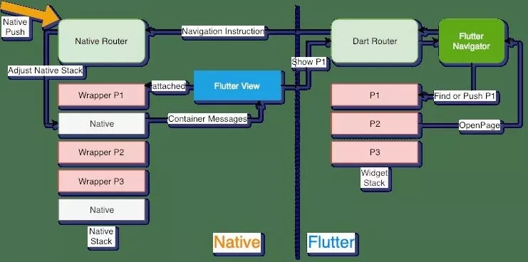
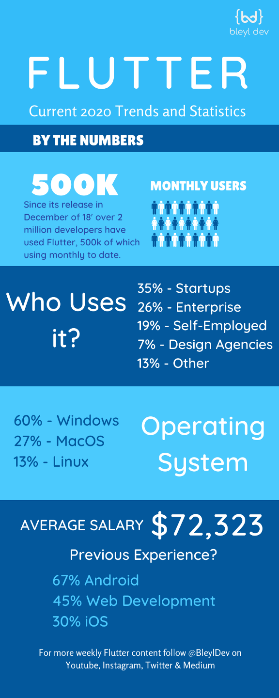
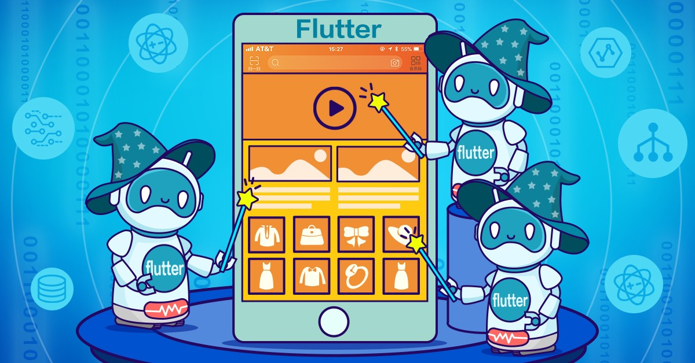

# Complete-Guide-To-Flutter(Mini Apps) :boom:

 

 
&nbsp;        
        
        
        
All the Mini Apps coded in Dart Language and live working project hosted on GitHub using the Flutter Mobile Developement UI Tool Kit. Working project can be found on the given below  links.

**Vision and Mission:** I am trying to create one of the biggest repo, related to Flutter with working application using Flutter Web. I will also post Important Link and Channels, to learn quickly with working procedure.
All Tutorials plus additional snippets and shorter posts can be found on the [repo](https://github.com/Solido/awesome-flutter).
### Show some love :heart: and star the repo to support the project

If you had like the project pls consider giving the star :star: icon on the top right corner of the Project .

### Project Created by:

**Rahul Chandra:**
A a Pre-Final Year Computer Science Student, an experienced Software Developer with a demonstrated history of working in the information technology and services industry. Seasoned Competative Coder. Skilled in C++, Python, Data Analysis, Java, Dart and Julia. Strong information technology professional with a Bachelor of Engineering - BE focused in Computer Science from Chandigarh University. 

**I am currently looking for Full Time/ Internship Offer for any Software Development Roles. Pls, checkout my [Resume](https://drive.google.com/file/d/1BYZcHo9SGrI5h10fxFbtqPLz86ni_VnR/view?usp=sharing)**.  I am very passionated about Software Development :heart:

### Working GIFS:

### Live Working Project:

#### 54 - Tensorflow Lite-Dog-Cat-Classifier-using-Flutter:

Created an Dog v/s Cat Classifer using Tensorflow in Flutter, to check the cat v/s dogs.

#### Unique Features of the Application:
* [✅] Used Kaggle Dataset of Cat/Dogs.
* [✅] Tensorflow Lite had been used to do the classification.
* [✅] Used around more than 2000 image each for Dog and Cat .
* [✅] Prediction percentage is overall 90%.
<!-- * [✅] Tensorflow Lite had been used to do the classification. -->

      
Everything is working quite fine and intutive.

<!-- **Deployed Link :point_right: [link](https://irahulcse.github.io/Flutter_Pokemon_App/)** -->

<!-- **Source Code of Project :point_right: [link](https://github.com/irahulcse/Flutter_Pokemon_App)** -->

#### 53 - Flutter Pokemon Application:

Flutter Pokemon Application is a very intutive and nice UI and JSON based Application in this we are basically fetching ther result from the JSON File to create UI. 

#### Unique Features of the Application:
* [✅]Widgets created for the UI are like as Card, Hero, Animation, Positioned.
* [✅] Parsed the data using **JSON Decode** which helped to bring the data from the API in the form of List.
* [✅]Map is an data structure which is used for passing it through the function.
* [✅] Live Working Project
* [✅] Widgets used like ListTile, ListView Builder, Center, Text and Circle Avatar Widgets
      
Everything is working quite fine and intutive.

**Deployed Link :point_right: [link](https://irahulcse.github.io/Flutter_Pokemon_App/)**

**Source Code of Project :point_right: [link](https://github.com/irahulcse/Flutter_Pokemon_App)**

#### 52 - Flutter Swiggy Application UI:

**Source Code of Project :point_right: [link](https://github.com/irahulcse/Flutter-Food-App-UI)**

**Living Working Project can be found here :point_right: [link](https://irahulcse.github.io/Flutter-Swiggy-Application-UI/#/)**

#### 51 - Flutter Movie App Using JSON:

**Source Code of Project :point_right: [link](https://github.com/irahulcse/Flutter-Movies-App-using-Json)**

**Live Working of the Project:**[link](https://irahulcse.github.io/Flutter-Movies-App-using-Json/),

#### 50 - Flutter Vertical Page Slider:

**Source Code of Project :point_right: [link](http://github.com/irahulcse/Flutter-Verticle-Page-Slider)**

#### 49 - Flutter Food App UI:

Flutter Food App UI is a project which is created to test the different animations options. It had used basic widgets like Column, Row and Expanded Widget and some Animations widgets are bundled with it.

      
Everything is working quite fine and intutive.

**Source Code of Project :point_right: [link](https://github.com/irahulcse/Flutter-Food-App-UI)**

#### 48 - Flutter NewsAPI.org:

Flutter NewsAPI is a project which is created to fetch the data from the NewsAPI.org and listing it using the Cached Network Image, HTTP and WebView Flutter plugins, so that we will be able to create a News Application in a limited amount of time.

    dependencies:
      flutter:
        sdk: flutter
      cached_network_image: ^2.2.0+1
      http: ^0.12.1
      webview_flutter: ^0.3.22+1
      
Everything is working quite fine and intutive.

**Source Code of Project :point_right: [link](https://github.com/irahulcse/Flutter_News_App_Org)**

#### 47- Flutter Web Sign In  Anomously App:

Integerated Firebase Authentication and tested using the Flutter Web. Easy to integerate and work with it.

    cloud_firestore: ^0.13.6
    flutter_screenutil: ^1.1.0
    random_color: ^1.0.5
    google_fonts: ^1.1.0

**This is an Flutter based Mobile Application, so nothing had been created till now.**

**Source Code Of Project :point_right: [link](https://github.com/irahulcse/Flutter_Web_Sign_In_Google_And_Anonymous)**

#### 46 - Flutter_Integerated_Square_Payment_Gateway :

**Source Code of Project :point_right: [link](https://github.com/irahulcse/Flutter_Integerated_Square_Payment_Gateway)**

#### 45 - Flutter-UI-Amazon-Clone-with-Integerated-Payment-Gateway :

**Source Code of Project :point_right: [link](https://github.com/irahulcse/Flutter-UI-Amazon-Clone-with-Integerated-Payment-Gateway)**

#### 44 - Flutter-Startup-Name-Generator :

**Source Code of Project :point_right: [link](https://github.com/irahulcse/Flutter-Startup-Name-Generator)**

<!--  -->

#### 43 -  Flutter-UI-Web-Newyork-Times:

**Source Code of Project :point_right: [link](https://github.com/irahulcse/Flutter-UI-Web-Newyork-Times)**

<!--  -->

#### 42 - Flutter Native-Application-with-Google-Maps-Integeration:

**Source Code of Project :point_right: [link](https://github.com/irahulcse/Flutter-Native-Application-with-Google-Maps-Integeration)**

<!--  -->

#### 41 - Flutter Notes-App-For-Mobile-App-using-Hive-Database:

**Source Code of Project :point_right: [link](https://github.com/irahulcse/Notes-App-For-Mobile-App-using-Hive-Database)**

<!--  -->

#### 40 - Flutter Quiz_Application_Flutter:

**Source Code of Project :point_right: [link](https://github.com/irahulcse/Quiz_Application_Flutter)**

<!--  -->

#### 39 - Flutter Whatsapp_UI_Clone_Flutter:

**Source Code of Project :point_right: [link](https://github.com/irahulcse/Whatsapp_UI_Clone_Flutter)**

<!--  -->

#### 38 - Flutter Dynamic_Theme_Enabled_Flutter :

**Source Code of Project :point_right: [link](https://github.com/irahulcse/Dynamic_Theme_Enabled_Flutter)**

<!--  -->

#### 37 - Flutter Chat_Application_Flutter:

**Source Code of Project :point_right: [link](https://github.com/irahulcse/Chat_Application_Flutter)**

<!--  -->

#### 36 - Flutter save_recipes:

**Source Code of Project :point_right: [link](https://github.com/irahulcse/save_recipes)**

<!--  -->

#### 35 - Flutter Covid_19_Flutter_App :

**Source Code of Project :point_right: [link](https://github.com/irahulcse/Covid_19_Flutter_App)**

<!--  -->

#### 34 - Flutter FriendChat Application :

**Source Code of Project :point_right: [link](https://github.com/irahulcse/FriendChat_App_Flutter)**

<!--  -->

#### 33 - Flutter Instagroot Application:

**Source Code of Project :point_right: [link](https://github.com/irahulcse/Instagroot_App_Flutter)**

<!--  -->

#### 32 - Flutter Food Application :

**Source Code of Project :point_right: [link](https://github.com/irahulcse/Flutter-Food-App)**

<!--  -->

#### 31 - Flutter RxDart GitHub Search API :

**Source Code of Project :point_right: [link](https://github.com/irahulcse/Rx_Dart_Github_Search_Api)**

<!--  -->

#### 30 - Flutter Chyker Foods Applictation:

**Source Code of Project :point_right: [link](https://github.com/irahulcse/Chyker-Food-s-App)**

<!--  -->

#### 29 - Flutter Instagram Shared Application:

**Source Code of Project :point_right: [link](https://github.com/irahulcse/Flutter-Instagram-Share)**

<!--  -->

#### 28 - Flutter Adobe XD:

**Source Code of Project :point_right: [link](https://github.com/irahulcse/Flutter_Adobe_XD)**

<!--  -->

#### 27 - Flutter Widgets Online Project :

**Source Code of Project :point_right: [link](https://github.com/irahulcse/Flutter-Widgets)**

<!--  -->

#### 26 - Flutter Quotes Application:

**Source Code of Project :point_right: [link](https://github.com/irahulcse/Flutter-Quotes-App)**

<!--  -->

#### 25 - Flutter Doctor Consultation Application :

**Source Code of Project :point_right: [link](https://github.com/irahulcse/Flutter-Doctor-Consultation-App)**

<!--  -->

#### 24 - Flutter Bloc Pattern Weather Application:

**Source Code of Project :point_right: [link](https://github.com/irahulcse/Flutter-Bloc-Pattern-Weather-App)**

<!--  -->

#### 23 - Flutter Bloc Pattern :

**Source Code of Project :point_right: [link](https://github.com/irahulcse/Flutter_Bloc_Pattern)**

<!--  -->

#### 22 - Flutter All In One Book Application:

**Source Code of Project :point_right: [link](https://github.com/irahulcse/All_In_One_Flutter_Book)**

<!--  -->

#### 21 - Flutter TikTok UI Applciation:

**Source Code of Project :point_right: [link](https://github.com/irahulcse/Flutter_TikTok_Ui)**

<!--  -->

#### 20 - Flutter Fetch Questions using Python:

**Source Code of Project :point_right: [link](https://github.com/irahulcse/Facelabs-Fetch-Questions-Python)**

<!--  -->

#### 019 - Flutter Connection with JSON based Application:

**Source Code of Project :point_right: [link](https://github.com/irahulcse/Flutter_Connecting_With_JSON)**

<!--  -->

#### 018 - Flutter Material Page Route Application:

**Source Code of Project :point_right: [link](https://github.com/irahulcse/Flutter_Material_Page_Route)**

<!--  -->

#### 16 - Flutter Miles to Kilometre Application:

**Source Code of Project :point_right: [link](https://github.com/irahulcse/Flutter_Miles_To_Kilometers_Converter)**

<!--  -->

#### 15 - Flutter Bloc Pattermn App:

Bloc Pattern and Mobx Management App are the different State Management which can be used to create states. BLoC pattern was conceived to allow the reuse of the very same code independently of the platform: web application, mobile application, back-end. So yeah, this pattern was developed aiming to ease the workload on developers end while developing apps for a different platform with the idea of code reusability. Watch the video below to get more insight on the baby steps set by BLoC.

**This is an Flutter based Mobile Application, so nothing had been created till now.**

**Source Code Of Project :point_right: [link](https://github.com/irahulcse/Flutter_Bloc_Pattern)**

#### 14 - Flutter Firebase Quote's App:

This App is basically created to learn about widgets like Expanded etc. The plugins used are mentioned below pls have a look to it.

    cloud_firestore: ^0.13.6
    flutter_screenutil: ^1.1.0
    random_color: ^1.0.5k
    google_fonts: ^1.1.0

**This is an Flutter based Mobile Application, so nothing had been created till now.**

**Source Code Of Project :point_right: [link](https://github.com/irahulcse/Flutter_Quotes_App_Firebase)**

#### 13 - Flutter_PDF_Viewer:

In this application, basically I had used the Flutter Plugin related to the PDF and Files. The name of the different Plugins are as follows:

    file_picker: ^1.9.0+1
    flutter_full_pdf_viewer: ^1.0.6
    flutter_plugin_pdf_viewer: ^1.0.7

Flutter Plugin PDF Viewer, gives us the hands on functionalites to see and scroll through the PDF, so that we can easily access it.

**Deployed Link :point_right: [link](https://irahulcse.github.io/Flutter_PDF_Viewer/#/)**

**Source Code Of Project :point_right: [link](https://github.com/irahulcse/Flutter_PDF_Viewer)**

#### 12 - Flutter_Web_Firebase_Authentication:

After so much hectic, I am succesfully able to integerate the Firebase Auth in Flutter Web. This is still in beta phase.

The best part is that all the functionalities are working properly, this is just the prototype version of the Flutter Web Firebase Authentication. More to be updated in the future.

The article which I had referred can be found on this [link]().

Everything is working quite fine and intutive.

**Source Code of Project :point_right: [link](https://github.com/irahulcse/Flutter_Web_Firebase_Authentication)**

**Deployed Link :point_right: [link](https://irahulcse.github.io/Flutter_Web_Firebase_Authentication/#/)**

#### 11 - Flutter_Mortage_Payment_App_1_Beta:

In this App, I had learnt about how to keep the minimalistic design and change the overall colour and design, which can be further used for the good UI concepts.

The App can be used for finding the interest rate about a particular Principal on the given Interest Rate and given time period. 

**Deployed Link :point_right: [link](https://irahulcse.github.io/Mortage_Payment_1_Beta/#/)**

**Source Code Of Project :point_right: [link](https://github.com/irahulcse/Mortage_Payment_1_Beta)**

#### 10 - Flutter_Bottom_Sheet_Tutorial :

**Deployed Link :point_right: [link](https://irahulcse.github.io/Flutter_Bottom_Sheet_Tutorial/#/)**

**Source Code Of Project :point_right: [link](https://github.com/irahulcse/Flutter_Bottom_Sheet_Tutorial)**

Learnt about the Modal Sheets and Bottom sheets and how they are different from each other.

If you found, it interesting pls :star: this repo. It will motivated me to work more hard.

#### 9 - Telegram UI Flutter:

**Deployed Link :point_right: [link](https://irahulcse.github.io/Telegram_Ui_Flutter/#/)**

**Source Code Of Project :point_right: [link](https://github.com/irahulcse/Telegram_Ui_Flutter)**

Created Telegram User Interface in Flutter using the widgets like ListTile, ListView and different builders like the ListView Builder Seperator and also used the other widgets like CircleAvator, Text widgets for UI etc.

If you found, it interesting pls :star: this repo. It will motivated me to work more hard.

#### 8 - Dice Game Flutter:

**Learnt from- The App Brewery Course**: Course Link is :point_right: [link](https://github.com/londonappbrewery/dicee-flutter).

**Deployed Link :point_right: [link](https://irahulcse.github.io/Dice_App_Flutter/#/)**

**Source Code Of Project :point_right: [link](https://github.com/irahulcse/Dice_App_Flutter)**

Dice App Flutter is the project, in which I had learnt about **Expanded** , **Flat Button** and how to differentiate betweeen the **Stateful** and **Stateless** widget properties with each other. I had also got to know about the **Math** properties related to dart. I had used the **rohan()** function to automate the task of generating the random numbers and changing the picture.

If you found, it interesting pls :star: this repo. It will motivated me to work more hard.

#### 7 - Portfolio's App Flutter:
**Deployed Link :point_right: [link](https://irahulcse.github.io/Portfolio_Card_Generator_Flutter/#/)**

**Source Code Of Project :point_right: [link](https://github.com/irahulcse/Portfolio_Card_Generator_Flutter)**

In this Porfolio App, I had learnt about the different widgets like **List Tile**, **Card** and how to use **Safe Area** for keeping the **App's UI** clean and beautiful.

If you found, it interesting pls :star: this repo. It will motivated me to work more hard.

  

#### 6 - Calculator's App Flutter:
**Deployed Link :point_right: [link](https://irahulcse.github.io/Calculator_App_Flutter/#/)**

**Source Code Of Project :point_right: [link](https://github.com/irahulcse/Calculator_App_Flutter)**

In this Calculator App, I had learnt about the different **Flutter States** and also implemented different **Themes** in it. I had also worked upon the different **Text Editing Controller** options like **TextInputFormatters** etc.

If you found, it interesting pls :star: this repo. It will motivated me to work more hard.

 

#### 5 - Flutter_Shop's_App:
**Deployed Link :point_right: [link](https://irahulcse.github.io/Flutter_Shop_App_Tutorial/#/)**

**Source Code Of Project :point_right: [link](https://github.com/irahulcse/Flutter_Shop_App_Tutorial)**

Flutter Shop's Application is the simple application which is used to learn the Grid View Builder and also the how to refer the learning.

It is a basic project which is used to learn about the widget's.

If you found, it interesting pls :star: this repo. It will motivated me to work more hard.

 

#### 4 - Sound_View_App_Flutter:
**Deployed Link :point_right: [link](https://irahulcse.github.io/Sound_View_App_Flutter/#/)**

**Source Code Of Project :point_right: [link](https://github.com/irahulcse/Sound_View_App_Flutter)**

Sound View App Flutter is the project in which I had integerated the Audio Player which can be further used to the click on the Emoji Icon's.

It is a basic project which is used to play the .mp3 files.

If you found, it interesting pls :star: this repo. It will motivated me to work more hard.

 

#### 3 - Rover's Guide (One Stop Solution For Travellers)  
**Deployed Link :point_right: [link](https://irahulcse.github.io/Rovers_Guide_Fluter/#/)**

**Source Code Of Project :point_right: [link](https://github.com/irahulcse/Rovers_Guide_Fluter)**

Rover's Guide is my Pre-Final Year Computer Science Engineering Project. The more is needed to be done in this project. Discussed more detailed in the below repo link. Source Code can be found with proper documentation on this [link](https://github.com/irahulcse/Rovers_Guide_Fluter).

If you found, it interesting pls :star: this repo. It will motivated me to work more hard.

 

#### 2 - Chat Application in Flutter   - 
**Deployed Link:point_right: [link](https://irahulcse.github.io/Chat_Application_Flutter/#/)**

This is the basic project in which I had created the simple application by learning from **MTECH VIRAL'S VIDEO**. Source Code can be found with proper documentation on this [link](https://github.com/irahulcse/Chat_Application_Flutter).

#### 1 - Building a Notes App in Flutter - UI example:
 In this tutorial we break down the UI into Flutter Widgets, complete our layout and then tweak to get our final design to match our screenshots.

### Flutter v/s React Native Infrastructure:

### Education/Contents:

All my brothers and sister, it is very important to understand that we are here to learn and excel in our professional life. So it's not really important from where we learn the stuff either from Youtube, Medium etc. If any one of you had some great website to share. Pls open an issue. I am looking forward to create the one of the **Biggest Repository On Flutter**, so that any one can learn from it.

#### Some Git Commands for Best Workflow Practices: 
You can follow the below workflow, if you are new to Git. 

#### Initial setup
1. Fork the main A-Complete-Guide-To-Flutter
2. Clone this repo on your machine
3. Add the main repo as "upstream"
  * `git remote add upstream https://github.com/irahulcse/A-Complete-Guide-To-Flutter`

#### Starting a new issue
1. Get the latest version of the project
  * `git fetch upstream`
  * `git checkout master`
  * `git pull upstream master`

2. Create a new branch starting from that newly updated main branch, and link it to your GitHub fork.
  * `git checkout -b MyNewIssue`
  * `git push --set-upstream origin MyNewIssue`

3. Make your changes, commit them, and push them to your fork
  * *make changes*
  * `git commit -a`
  * *write a good commit message*
  * `git push`

#### Rebasing your branch
When there have been changes in the main repo that you want to get, the cleanest option is often to rebase your branch on top of the latest commits.

1. Get the latest commits and update your local master branch
  * `git fetch upstream`
  * `git checkout master`
  * `git pull upstream master`

2. Rebase your in-progress feature branch
  * `git checkout MyInProgressFeature`
  * `git rebase master`
  * `git push -f`

#### Resetting a branch after you've messed it up
1. Make sure there isn't any work that you care about losing
2. Do a hard reset to the branch you want to restart from.
  * `git checkout MyMessedUpBranch`
  * `git reset --hard upstream/master`

#### Adding a single commit from one branch to another branch
1. Find and copy the commit ID that you want to use
2. Cherry-pick that commit
  * `git checkout MyCleanBranch`
  * `git cherry-pick COMMIT_ID`

### Getting Started

For help getting started with Flutter, view our online
[documentation](https://flutter.dev/).

### Flutter Opportunities in 2020:

## Contribution:
Please clone and star this repo to stay up to date on changes. If anyone, would like to contribute to it. You can open the issue and start contributing to it.

## License

Copyright (c) 2020 Rahul Chandra

Permission is hereby granted, free of charge, to any person obtaining a copy of this software and associated documentation files (the "Software"), to deal in the Software without restriction, including without limitation the rights to use, copy, modify, merge, publish, distribute, sublicense, and/or sell copies of the Software, and to permit persons to whom the Software is furnished to do so, subject to the following conditions:

The above copyright notice and this permission notice shall be included in all copies or substantial portions of the Software.

THE SOFTWARE IS PROVIDED "AS IS", WITHOUT WARRANTY OF ANY KIND, EXPRESS OR IMPLIED, INCLUDING BUT NOT LIMITED TO THE WARRANTIES OF MERCHANTABILITY, FITNESS FOR A PARTICULAR PURPOSE AND NONINFRINGEMENT. IN NO EVENT SHALL THE AUTHORS OR COPYRIGHT HOLDERS BE LIABLE FOR ANY CLAIM, DAMAGES OR OTHER LIABILITY, WHETHER IN AN ACTION OF CONTRACT, TORT OR OTHERWISE, ARISING FROM, OUT OF OR IN CONNECTION WITH THE SOFTWARE OR THE USE OR OTHER DEALINGS IN THE SOFTWARE.

